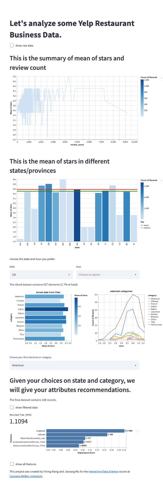
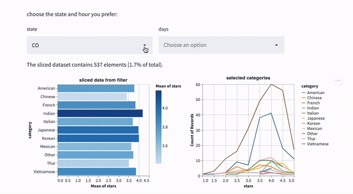
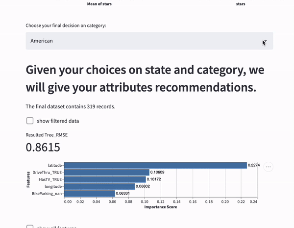

# Choose a restaurant

## A quick tour for our project
**The project is made by four parts:**
1. A summary of mean of stars and review counts.
2. A bar chart of mean of stars in all states/provinces along with two rules(all data median and mean)
3. Choose the state and days
4. Decide the category and the **features importance of DecisionTree Regression**

*hint: we also have checkbox to show the data*

## Project Goals
Our project use Yelp data to help a user to see the stars in different states/provinces in North America. The user can choose the **state** and **days** in which he/she want to open a restaurant. Then the project will show the rating of different categories in selected state and days. At last the user needs to decide which **state.** he/she want to open the restaurant. Then we use a **DecisionTree Regression** to find the features that infuluence the rate of the stars. The user can decide whether to invest on these features to provide better services.

## Design
We use several charts to help the user understand what they are seeing
The following gifs show how to use there filters:
### Choose state and days
Here in these two charts. After you choose the state and the days, you can click on the left chart to choose multiple categories by press **SHIFT** and click. The right line chart will show what you selected in the left chart.

### Decide category

TODO: **A rationale for your design decisions.** How did you choose your particular visual encodings and interaction techniques? What alternatives did you consider and how did you arrive at your ultimate choices?

## Development

### How we process the data:
The raw data was JSON form. So we use pandas to formalize the JSON data and transfer it into a CVS file. We keep about **50,000** out of **160,000** rows data because the other part of data are not related to restaurant. And also about **14,000** rows data are from restaurants that marked as "not_open", so we also drop them. Finally we have about 36,000 rows of data.

 For **days**, these data are originally stand for the time scope of openning. We transfer these data into **0/1** forms(1 for open that day,0 otherwise)

And the catogory data are originally multiple tags about this restaurant, like *"Salad, Soup, Sandwiches, Delis, Restaurants, Cafes, Vegetarian"*. We simplify the category to one word, like 'vegeratian'. We use the function category() to filter all the tags. In fact, this function is not precise since we don't classify all the tags. So you will see lots of "Other" category in our charts.The category list is actually from Yelp's offical website:
https://blog.yelp.com/businesses/yelp_category_list/#section21

@norawangyining(**Yining Wang**) makes the **DecisonTree Regression Model** and the first two charts
@JackInCMU(**Jiaxiang Wu**) makes the **Interactive charts** and filter function(
**WriteUP** was finished by the entire team

[//]: # (Yining Wang:)
[//]: # (Jiaxiang Ww: spent about 15 hours in total, the interactive charts took the most time)

TODO: **An overview of your development process.** Describe how the work was split among the team members. Include a commentary on the development process, including answers to the following questions: Roughly how much time did you spend developing your application (in people-hours)? What aspects took the most time?

## Success Story
@JackInCMU(**Jiaxiang Wu**) Actually it's very hard to find a good dataset. We spent about two hours then we found a dataset that was acceptable. Also, the dataset has lots fo N/A and we have to clean the dataset first. It was tough for me to deal with the 160,000 rows of data at first. I can imagine how hard would it been when it comes to the real industry needs.

On the other hand, it's important to read the official documents of any library. These documents can help you understand any function in a short time. And also, thanks to StackOverFlow, it's really a good website.

TODO:  **A success story of your project.** Describe an insight or discovery you gain with your application that relates to the goals of your project.
