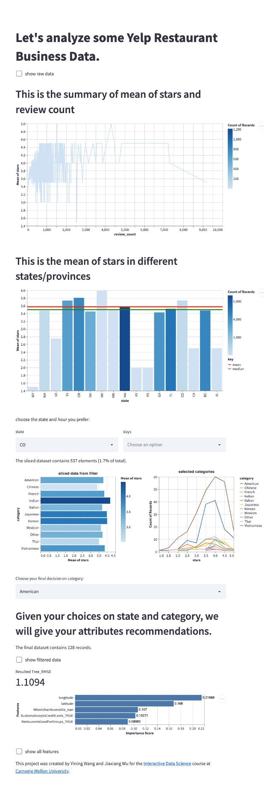
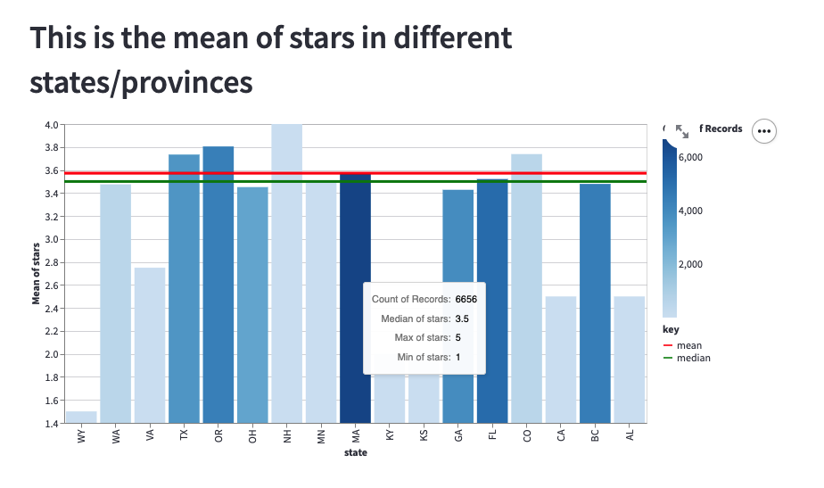
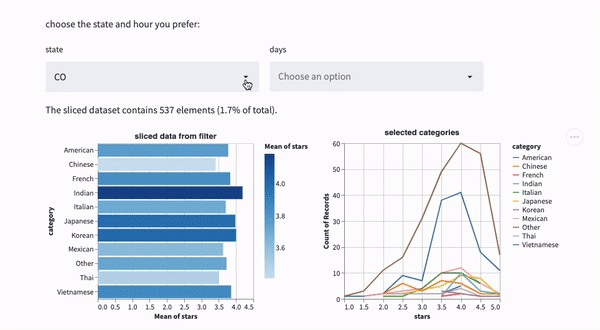
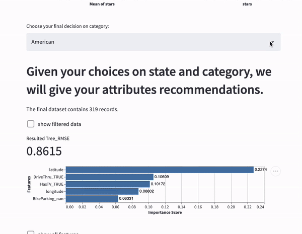

# Restaurant Incubator
 
## Project Goals
Our project aims to assist entrepreneurs who wants to open a restaurant in the United States by giving them recommendations on the **Where** ,**When**, **What**, **How** questions:
- **Where**: Where should I locate my business?
- **When**: When should my restaurant open? 
- **What**: What category of cuisines should I choose?
- **How**: How can I add other attributes to accelerate my business? 

Considering 92% of consumers now read online reviews before purchasing, a positive presence on Yelp can give a small business a huge advantage. Thus, our project uses Yelp Dataset(https://www.yelp.com/dataset), and we choose **stars** as out objective, specifcally, we want to gave audience recommendations that could maximize the values of stars. 

<!-- Our project use Yelp data to help a user to see the stars in different states/provinces in North America. The user can choose the **state** and **days** in which he/she want to open a restaurant. Then the project will show the rating of different categories in selected state and days. At last the user needs to decide which **state.** he/she want to open the restaurant. Then we use a **DecisionTree Regression** to find the features that infuluence the rate of the stars. The user can decide whether to invest on these features to provide better services. -->

## Quick Tour for Our Project
**The project is made by four parts:**
1. A summary of the relationship between mean of stars and review counts.
2. A bar chart shows relationship between state and stars. 
3. Choose state and days, find relationship between category and stars.
4. Explore attribute recommendations with Decision Tree regression model.

*hint: we also have checkbox to show the data*

## Design
We use several charts to help the user understand what they are seeing\
The following gifs show how to use there filters:
### 1. Relatonship between review counts and stars 
This graph is intended to show if there is any outliers that is caused by th lack of review counts. If the restaurant is just open, it is likely that the reviews is made by the friends or relatives of the business owner, which causes biased data. From the graph, we can see the vias didn't appear in this dataset we choose. 
### 2. Relationship between state and stars. 
From this graph, the user can see a distribution of rating preferences in each states. Specifically, if the user has decided to start business in GA, we can see the average rating there is 0.1 lower than average, thus the user has a rough measurement in the future. If in the future, his/her restaurant got a star of 3.5, although it below the country average, the restaurannt did a good job in the GA. \
By hovering on each bar, the user is able to see the statistics of each states. Each bar is colored in different intensities, if the color is deep blue, it means the states has sufficient data, thus the statistics is more reliable; else, if light blue, the data counts is smaller, thus the statistic is less reliable.

### 3. Choose state and days, find relationship between category and stars.
Here, the user has decided where he wants to open his business, and he can mulyi-choose the days the restaurant opens. After user decided the state and the days, the user is able to see the popularity distributions of different categories of cusines. 
User can click on the left chart to choose multiple categories by press **SHIFT** and click. The right line chart will show what you selected in the left chart.\n
Foe example, from the gif, we can see French, Korean and indian cusines is easier to get high ratings in the state of BC. 

### 4. Explore attribute recommendations. 
On this step, the user should have decide the state, hours and category of cuisines for his/her business. After the user select those three, the program will automatically compute the data that satisfies the filters. The user is able to see the data by clicking "show filter data". \
With the filtered data, we use machine leanrning model - Decison Tree Regression - to draw the relationships between attributes with stars. The attributes contains 37 features, including latitude, longitude, freeWIFI, hasTV ... so on, that users could add to increase the poplarity of his/her business. The model will computes the distribution of each feature and its importance in rating contribution. We selected the top five features for recommendations. If the user is interested in all features that have positive contributions, just click "show all features".  

<!-- TODO: **A rationale for your design decisions.** How did you choose your particular visual encodings and interaction techniques? What alternatives did you consider and how did you arrive at your ultimate choices? -->

## Development

### How we process the data:
The raw data was JSON form. So we use pandas to formalize the JSON data and transfer it into a CVS file. We keep about **50,000** out of **160,000** rows data because the other part of data are not related to restaurant. And also about **14,000** rows data are from restaurants that marked as "not_open", so we also drop them. Finally we have about 36,000 rows of data.

 For **days**, these data are originally stand for the time scope of openning. We transfer these data into **0/1** forms(1 for open that day,0 otherwise)

And the catogory data are originally multiple tags about this restaurant, like *"Salad, Soup, Sandwiches, Delis, Restaurants, Cafes, Vegetarian"*. We simplify the category to one word, like 'vegeratian'. We use the function category() to filter all the tags. In fact, this function is not precise since we don't classify all the tags. So you will see lots of "Other" category in our charts.The category list is actually from Yelp's offical website:
https://blog.yelp.com/businesses/yelp_category_list/#section21

@norawangyining(**Yining Wang**) 
- Makes the **DecisonTree Regression Model** and the first two charts.\
- Roughtly 16 hours in total. Spent most of the time in data selection, data cleanning, and model training.

@JackInCMU(**Jiaxiang Wu**) 
- Makes the **Interactive charts** and filter function.
- Spent about 15 hours in total, the interactive charts took the most time

**WriteUP** was finished by the entire team.

<!-- TODO: **An overview of your development process.** Describe how the work was split among the team members. Include a commentary on the development process, including answers to the following questions: Roughly how much time did you spend developing your application (in people-hours)? What aspects took the most time? -->

## Success Story
### @JackInCMU(**Jiaxiang Wu**) 

Actually it's very hard to find a good dataset. We spent about two hours then we found a dataset that was acceptable. Also, the dataset has lots fo N/A and we have to clean the dataset first. It was tough for me to deal with the 160,000 rows of data at first. I can imagine how hard would it been when it comes to the real industry needs.

On the other hand, it's important to read the official documents of any library. These documents can help you understand any function in a short time. And also, thanks to StackOverFlow, it's really a good website.

### @norawangyining(**Yining Wang**) 
Add to Jiaxiang's comments, when we are choosing the datasets, we found interesting datasets are often not free. What I mean by interesting, is that the dataset can solve real world unsolved problems. \
From our analysis, it is interesting to find that foreign dishes are quite popular in the United States. Especially for Indian and Korean dishes, they usually have higher ratings than the local american dishes. 

TODO:  **A success story of your project.** Describe an insight or discovery you gain with your application that relates to the goals of your project.
